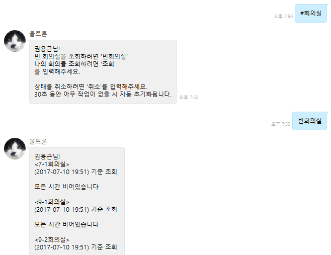
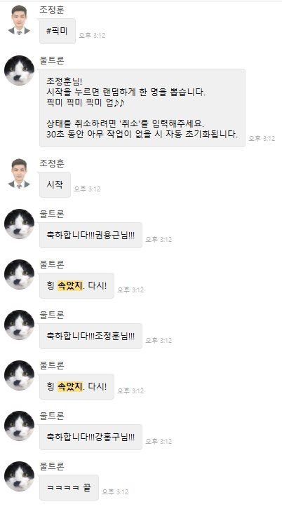
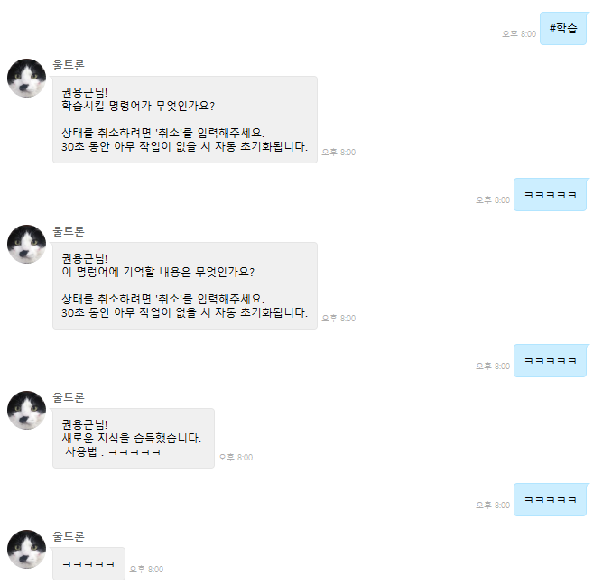
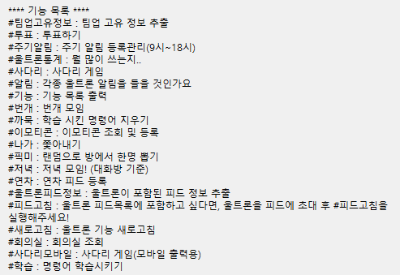

# Kingbbode Chat Bot Framework

*최초 작성일 : 2017-02-07*

**https://github.com/kingbbode/chatbot-framework 에서 이전되었음.**

*Document 는 최하단 작성*

## 왜 개발하는가?

- 만들고 있는 Chat Bot을 알아가고 있는 지식을 적용한 리펙토링 및 라이브러리화 하고 싶어서
- 챗봇 개발의 진입 장벽을 낮춰주기 위해서
- 메신저 상관없는 통합 Chat Bot은 반드시 필요할 것 같아서

## 기반 기술은?

- Spring Framework 위에서 만드는 프레임워크?(프레임워크 in 프레임워크?);는 아니고 그냥 Spring Framework 쓴 개발임.
- Java Reflection과 Spring AOP를 활발히 사용
- Generic과 Interface를 통한 다형성
- Java8 적극 활용

## 컨셉

- 봇의 뇌와 뇌세포라는 의미로, 구현체 객체를 `Brain` , 구현체 객체 내부에 하나의 명령어와 Mapping되는 기능을 `BrainCell` 이라고 컨셉을 잡음.
- Annotaion 기반의 구현체 개발(Spring의 Controller를 모방, @Conroller - @Brain, @RequestMapping - @BrainCell) 
- 모든 요청과 반환을 담당하는 `DispatcherBrain`
- 모든 Brain의 생성 및 반환 역할을 하는 `BrainFactory`

## 현재 상태는?

- 기능과 패키지 등의 분리는 어느정도 완료.
- 모듈화를 한다고 했지만, 코드가 굉장히 지저분하여 리펙토링이 시급함(그래서 테스트코드가 더 시급함).
- 기능 및 동작에 대한 분리는 완료.
- 마지막 커밋으로 챗봇 Service 구현부, 챗봇 코어, 챗봇 메신저 라이브러리를 분리 완료.
- 나름 Spring Boot Starter 만들었으나, 잘 모르고 만들어서 지저분함.

## 앞으로 계획

- 테스트 케이스 작성..(TDD....가 뭔지도 몰랐던 시절부터 작성되어 이제는 테스트 붙이는게 일이..)
- 카카오, 슬랙, 텔레그램 등의 메신저 라이브러리 확장.
- 메신저 라이브러리가 확장된다면 각각의 sub starter로 다시 분리.

## 활용

거의 노는 용..

### 회의실 조회 기능



### 이모티콘 기능



### 학습



### 등등 하여 2017-07-10 현재



---

## Document

### application.properties

```java
# CHAT-BOT
chatbot.name = default
chatbot.basePackage = com.kingbbode.example
chatbot.enabled = true
chatbot.enableBase = true
chatbot.enableEmoticon = true
chatbot.enableKnowledge = true
# Redis
chatbot.hostName = localhost
chatbot.port = 6879
chatbot.timeout = 0
chatbot.password = {password}
chatbot.usePool = true
chatbot.useSsl = false
chatbot.dbIndex = 0
chatbot.clientName = {clientName}
chatbot.convertPipelineAndTxResults = true
# Command
chatbot.commandPrefix = #
chatbot.emoticonPrefix = @

# TEAMUP
chatbot.teamup.enabled = true
chatbot.teamup.id = {아이디}
chatbot.teamup.password = {비밀번호}
chatbot.teamup.clientId = {clientId}
chatbot.teamup.clientSecret = {clientSecret}
chatbot.teamup.testRoom = {DEV 모드 테스트 방 번호}
chatbot.teamup.testFeed = {DEV 모드 테스트 피드 번호}
chatbot.teamup.bot[0] = {bot user id}
..
chatbot.teamup.bot[n] = {bot user id}
```

**Core**

- chatbot.name : chatbot 이름(redis key의 prefix가 됨)
- chatbot.basePackage : Root Package 를 지정 - default ""
- chatbot.enabled : {true or false} 챗봇 사용 여부 - default false
- chatbot.enableBase = {true or false} Base Brain 사용 여부(base Brain 에는 기능 목록을 출력하는 기능이 작성되어 있음) - default true
- chatbot.enableEmoticon = {true or false} Emoticon Brain 사용 여부(emoticon Brain 에는 @를 prefix로 받아 이모티콘을 처리하기 위한 기능이 작성되어 있음, 이모티콘을 저장하는 형태는 구현 프로젝트에서 작성해야 함) - default false
- chatbot.enableKnowledge = {true or false} Knowledge Brain 사용 여부( knowledge Brain 에는 학습 기능이 작성되어 있음) - default false
- chatbot.commandPrefix = 명령어의 접두어
- chatbot.emoticonPrefix = 이모티콘 접두어

**Redis**

대화형(이전 대화와 연결되는 형태)을 완성시키기 위해 대화 상태를 저장하는 저장소를 `REDIS` 로 사용.

- chatbot.hostName : - default "localhost"
- chatbot.port : - default 6379
- chatbot.timeout : - default 2000
- chatbot.password : - default null
- chatbot.usePool : - default true
- chatbot.useSsl : - default false
- chatbot.dbIndex : - default 0
- chatbot.clientName : - default null
- chatbot.convertPipelineAndTxResults : - default true

**메신저 TEAMUP**
  
- chatbot.teamup.enabled = {true or false} (사용 여부)
- chatbot.teamup.id = {아이디}
- chatbot.teamup.password = {비밀번호}
- chatbot.teamup.clientId = {clientId}
- chatbot.teamup.clientSecret = {clientSecret}
- chatbot.teamup.testRoom = {DEV 모드 테스트 방 번호}
- chatbot.teamup.testFeed = {DEV 모드 테스트 피드 번호} 
- chatbot.teamup.bot[0-N] = {메시지를 무시할 대상}

### Example Project

[Spring Boot Starter Chatbot Example](https://github.com/kingbbode/spring-boot-starter-chatbot-example)
